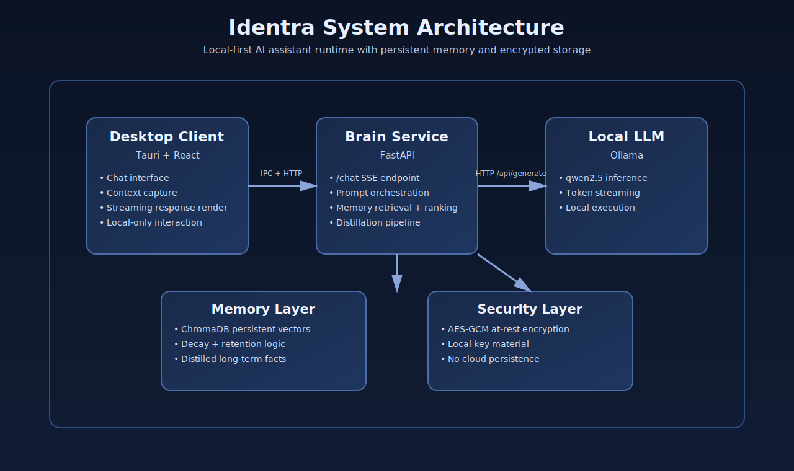
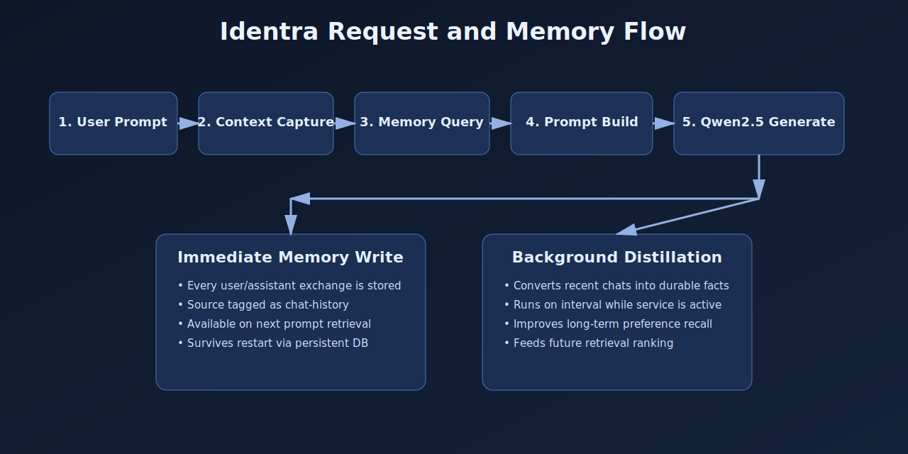

# Identra Core

Identra Core is a local-first AI assistant runtime that combines a desktop client, a Python brain service, and a local language model stack. The application is designed for persistent user context, encrypted memory storage, and low-latency on-device responses.

## Product Overview

Identra provides:

- Real-time chat with token streaming.
- Persistent memory across sessions.
- Name and profile recall backed by local storage.
- Context-aware prompt building from active app and selected text.
- Local inference through Ollama using qwen2.5 as default.
- Encrypted memory payloads at rest.

## System Architecture



### Runtime Flow



## Core Components

### Desktop Application (Tauri + React)

- Handles user chat interactions and streaming UI updates.
- Captures runtime context from the active desktop session.
- Calls Brain service endpoints through local networking.

### Brain Service (FastAPI)

- Serves chat, memory, and readiness endpoints.
- Retrieves memory candidates and composes grounded prompts.
- Persists raw chat history and distilled long-term facts.
- Maintains startup state and service diagnostics.

### Memory Subsystem (ChromaDB + encryption)

- Stores encrypted memory documents in local vector storage.
- Uses similarity search plus decay-weight ranking.
- Persists user profile data in local state files.

### Inference Layer (Ollama)

- Runs fully local model inference.
- Default model: `qwen2.5`.
- Streams generation output for responsive UX.

## Repository Layout

```
identra-core/
├── apps/
│   └── identra-brain/
│       ├── src/
│       │   ├── api/
│       │   ├── llm/
│       │   ├── memory/
│       │   └── setup/
│       └── requirements.txt
├── clients/
│   └── identra-desktop/
│       ├── src/
│       └── src-tauri/
├── libs/
│   ├── identra-core/
│   └── identra-crypto/
├── docs/
│   └── images/
├── Justfile
├── Cargo.toml
└── .env.example
```

## Production Prerequisites

- Linux, macOS, or Windows workstation with local resources for LLM inference.
- Python 3.10+.
- Node.js 18+ with pnpm.
- Rust toolchain (stable).
- Docker or native Ollama installation.

## Installation

```bash
git clone https://github.com/IdentraHQ/identra-core.git
cd identra-core
just setup
```

## Runtime Startup

Run the application stack in separate terminals.

### 1) Start Ollama

If using Docker:

```bash
docker start ollama || docker run -d --name ollama -p 11434:11434 -v "$HOME/.ollama:/root/.ollama" ollama/ollama
```

Ensure model availability:

```bash
docker exec ollama ollama pull qwen2.5
```

### 2) Start Brain Service

```bash
just dev-brain
```

### 3) Start Desktop Application

```bash
just dev-desktop
```

## Configuration

Copy and adjust environment values:

```bash
cp .env.example .env
```

Key parameters:

- `OLLAMA_URL=http://localhost:11434`
- `OLLAMA_MODEL=qwen2.5`
- `BRAIN_HOST=127.0.0.1`
- `BRAIN_PORT=8000`
- `IDENTRA_USER_NAME=`

## API Endpoints

### Health and readiness

- `GET /health`
- `GET /ready`

### Chat and memory

- `POST /chat`
- `POST /chat/record`
- `POST /memory/add`
- `POST /memory/retrieve`

### Diagnostics

- `GET /debug/logs`

## Persistence and Data Paths

Runtime data is persisted under `~/.identra`:

- `~/.identra/chroma_db` for vector memory.
- `~/.identra/profile.json` for profile metadata.
- `~/.identra/state.json` for setup/runtime state.
- `~/.identra/logs` for service logs.

## Security Model

- Memory records are encrypted before persistence.
- Keys are generated and stored locally on first run.
- No mandatory cloud dependency for inference or storage.

## Operational Validation

Use these checks in production bring-up and incident response:

```bash
curl -s http://127.0.0.1:11434/api/tags
curl -s http://127.0.0.1:8000/health
curl -s http://127.0.0.1:8000/ready
```

## Troubleshooting

### Brain service unavailable

```bash
lsof -i :8000
cat ~/.identra/logs/brain.log
```

### Ollama not reachable

```bash
docker ps | grep ollama
curl -s http://127.0.0.1:11434/api/tags
```

### Memory does not appear in responses

```bash
curl -s http://127.0.0.1:8000/ready
ls -la ~/.identra/chroma_db
```

## License

This project is licensed under the terms in [LICENSE](LICENSE).
